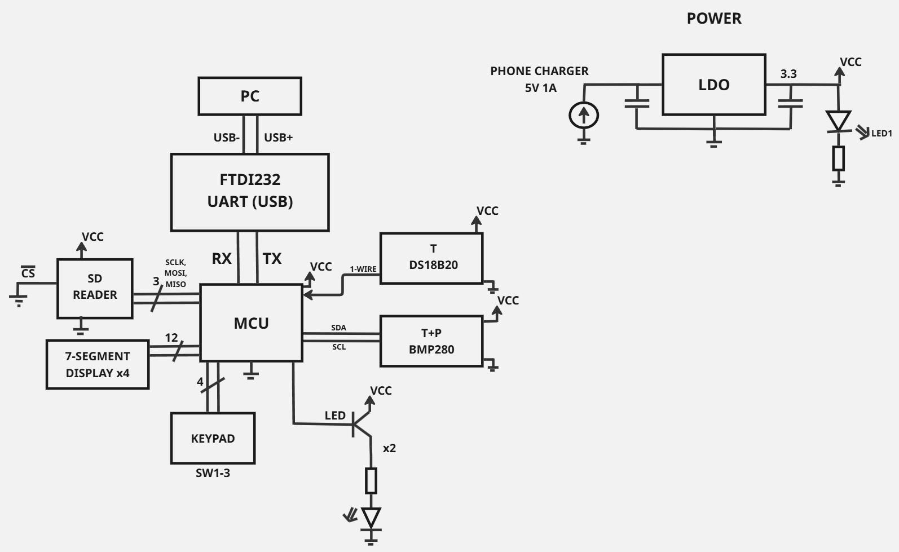

# Dokumentacja projektu
## Schemat blokowy

## Schemat ideowy
### Blok mikrokontrolera (ATmega328PB)
*Obliczanie wartości pojemności C1 i C2 potrzebnych do zewnętrznego oscylatora MCU:*    

Dla uproszczenia obliczeń, niech C1 = C2.    
Korzystając ze wzoru z dokumentacji ATmega,   
**C = 2 * C_L + C_S**  
gdzie     
C_L - Pojemnosć obciążenia kryształu,   
C_S - Pojemność pasożytnicza płytki PCB  
    
Dla naszego kryształu C_L wynosi ... pF    
Stąd wynika, że C powinno mieć wartość ... pF