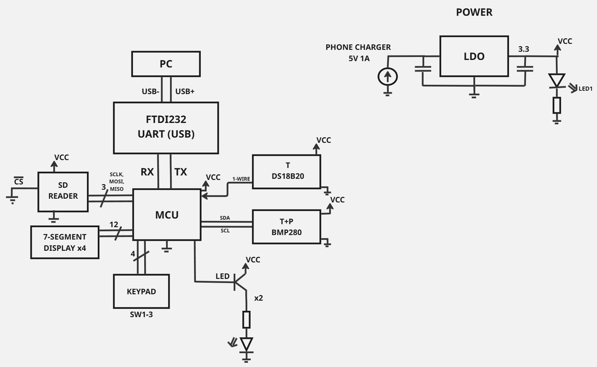
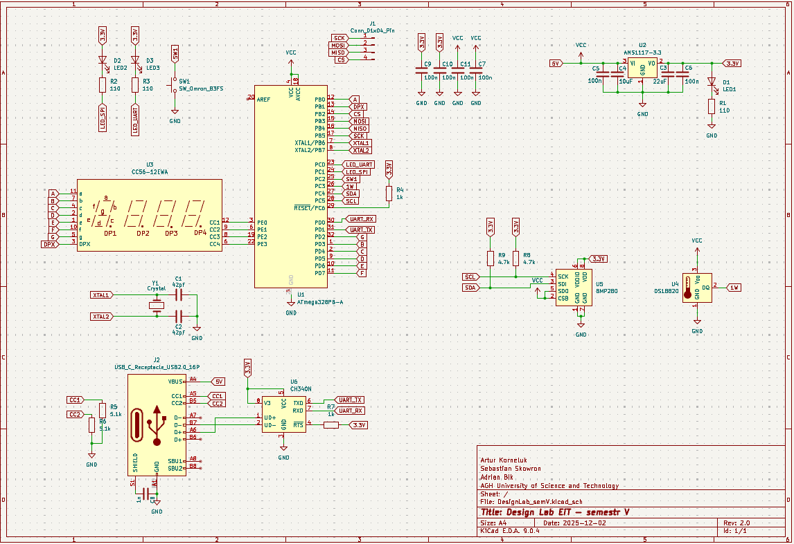
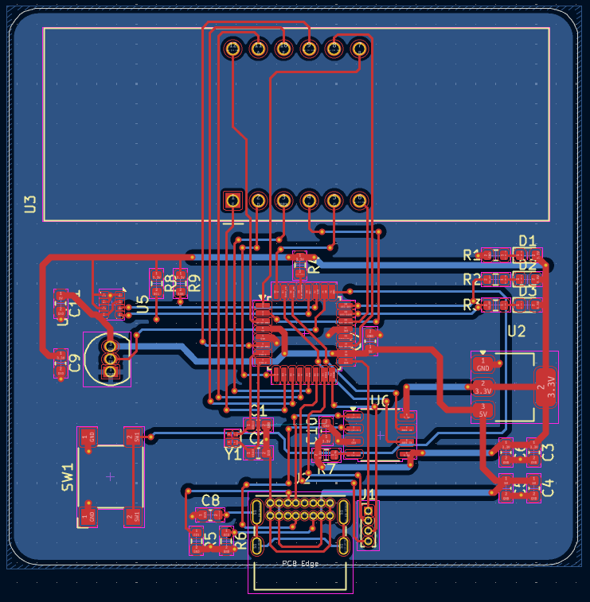
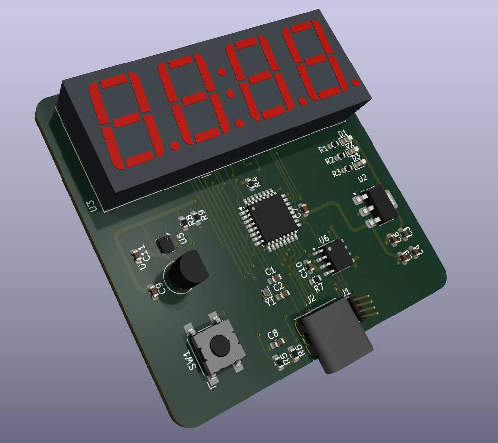

# Dokumentacja projektu
## Schemat blokowy

## Schemat ideowy

## Design PCB

## Podgląd 3D

### Blok mikrokontrolera (ATmega328PB)
*Obliczanie wartości pojemności C1 i C2 potrzebnych do zewnętrznego oscylatora MCU:*    

Wybraliśmy CY16BPS ponieważ jego parametry należą do najpopularniejszych do użycia w projektach z tym MCU.    
Oto jego najważniejsze parametry:   
- F_XTAL = 16 MHz
- C_load = 20 pF
- ESR = 50 ohm

Dla uproszczenia obliczeń, niech C1 = C2.    
Korzystając ze wzoru z dokumentacji ATmega,   
**C = 2 * C_L + C_S**  
gdzie     
C_L - Pojemnosć obciążenia kryształu,   
C_S - Pojemność pasożytnicza płytki PCB, niech wynosi 2 pF
    
Dla naszego kryształu C_L wynosi 20 pF    
**Stąd wynika, że C powinno mieć wartość około 42 pF.**

### Diody LED do sygnalizacji
*Obliczanie wartości rezystancji R1, R2 i R3 potrzebnych do uregulowania pracy diód:*     
    
Napięcie zasilania: 3.3V
Kolor diód LED: zielony co oznacza spadek napięcia około 2.2V   
Chcemy ustalić bezpieczny punkt pracy, powiedzmy 10mA    
Z prawa ohma: R = U / I = (3.3 - 2.2) / 10 mA = **110 ohm**

### Rezystancja podciągająca dla linii I2C
Wartość rezystancji podciągającej dla I2C jest wymianą pomiędzy możliwą prędkością wymiany danych a zużyciem energii.     

Zbyt mała wartość może uniemożliwić pinowi układu scalonego z którym się komunikujemy zwarcie linii z masą. Zalezy ona więc od najniższego napięcia jaka może być odczytana przez dany ukł. (U_OL) oraz prądu jaki jest on w stanie wytrzymać (I_OL).     

**R_min = (V_CC - U_OLmax) / I_OL**     

Zbyt duża zaś, przy dużych prędkościach może nie nadążyć z naładowaniem pojemności magistrali (C_m) przed nadejściem kolejnego stanu niskiego. W związku z tym, zależy ona od czasu narastania zboczy.     

**R_max = t_r / (0.8473 * C_m)**     
*Wartość 0.8473 = -ln(0.3) wynika z czasu ładowania pojemności od  30% - 70%*     

Przy naszych małych prędkościach komunikacji oraz z pojedynczym urządzeniem na magistrali, przyjmiemy standardową wartość **4.7kΩ.**